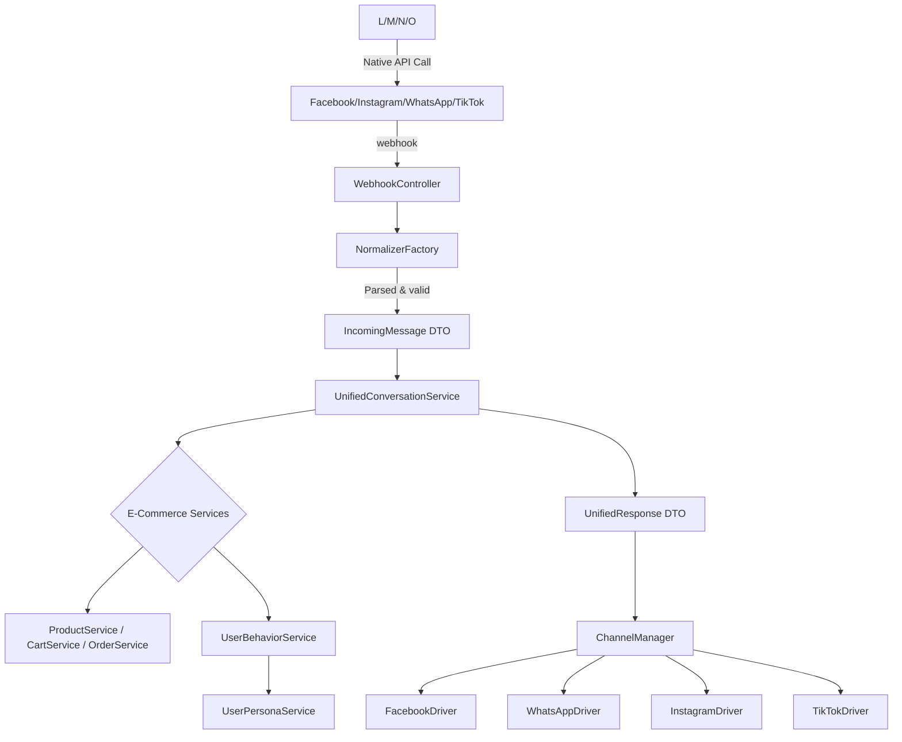

# EskycodeShop — Omnichannel Agentic E‑Commerce Platform

## Architecture Overview

The platform‑specific knowledge lives only in the **Normalizers** (incoming) and **Drivers** (outgoing). Everything in between works identically regardless of the channel.